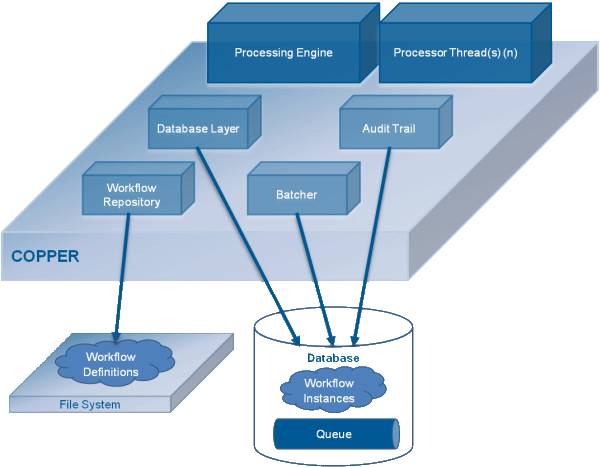

# Copper 工作流引擎

> [Copper](http://copper-engine.org)是一个开源，强大，轻量，且易用的工作流引擎，使用Java代码描述工作流。

## 强大 - 高效率的工作流引擎

- 自动故障恢复  
- 动态资源分配
- 热部署
- 版本控制
- 长期运行（一个月或以上）
- 高可用支持（Cassandra、Oracle）

## 基于Java语言实现

相比于其它Java语言实现的工作流引擎，Copper不仅100%使用Java编写，同时也是使用Java代码定义一个工作流。

此外，基于Class是可以动态加载的特性，你也可以动态修改工作流。

Copper运行在Java7或者Java8

## 开源 - Apache License 2.0

在[GitHub](https://github.com/copper-engine/copper-engine)上开放全部的源代码，以及提供丰富的文档说明

---

## 组件架构



### *Processing Engine 处理引擎*

- Copper的核心组件，用于执行工作流实例
- 单进程运行
- 有Transient（非持久化）和Persistent（持久化）两种工作流引擎

### *Workflow Repository 工作流仓库*

- 封装存储，和处理工作流的定义
- 从文件中读取工作流
- 热部署：观察文件是否有修改

### *Database Layer 数据库层*

- 将数据库与Copper解偶
- 封装访问Persistent工作流的方式
- 开放自定义存储，以扩展未被支持的数据库

### *Audit Trail 逐位跟踪*

- 实现了简单常用的逐位跟踪

---

## Hello World

```java
@WorkflowDescription(...)
public class HelloWorldWorkflow ... {

    @Override
    public void main() throws Interrupt {
        String cid = "1";
        logger.info(String.format("Workflow{def=%s, cid=%s}: %s", WorkflowDef.HELLO_WORLD, cid, "Waiting"));

        wait(WaitMode.ALL, 9 * 1000, cid);
        Response<String> response = getAndRemoveResponse(cid);
        logger.info(String.format("Workflow{def=%s, cid=%s}: %s", WorkflowDef.HELLO_WORLD, cid, response.getResponse()));
    }

    ...
}
```

```java
public class HelloWorldWorkflowTests {

    public static void main(String[] args) throws Exception {
        ...

        // 创建工作流引擎，并启动
        ProcessingEngine engine = TransientEngineFactory.create(sourceDir, targetDir);
        engine.startup();

        // 启动工作流。工作流启动后，会马上进入等待
        engine.run(WorkflowDef.HELLO_WORLD, null);

        // 延迟3秒，模拟业务处理时间
        Thread.sleep(3000);

        // 唤醒工作流
        Response<String> response = new Response<>("1", "Hello, I am the World", null);
        Acknowledge.DefaultAcknowledge ack = new Acknowledge.DefaultAcknowledge();
        engine.notify(response, ack);
        ack.waitForAcknowledge();
    }

    ...
}
```

```text
[INFO] 2017-04-01 20:49:46 Workflow{def=HELLO_WORLD, cid=1}: Waiting
[INFO] 2017-04-01 20:49:49 Workflow{def=HELLO_WORLD, cid=1}: Hello, I am the World
```

*PS：本文使用的是copper-4.2.0*