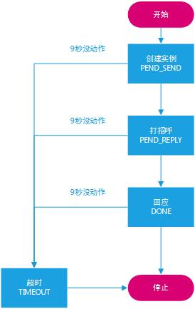

# Copper - Transient Engine 非持久化工作流引擎

> 非持久化工作流引擎创建的工作流只会保存在运行内存中，服务关闭即丢失。

## Hello World 示例



### *创建工作流引擎ProcessingEngine*

```java
/**
 * 创建非持久化工作流引擎
 * @param sourceDir 工作流源码存放的路径
 * @param targetDir 编译后存放的路径
 * @return
 */
public static TransientScottyEngine create(String sourceDir, String targetDir) {
    TransientScottyEngine engine = new TransientScottyEngine();
    engine.setIdFactory(createIdFactory());
    engine.setEngineIdProvider(createEngineIdProvider());
    engine.setDependencyInjector(createDependencyInjector());
    engine.setPoolManager(createProcessorPoolManager());
    engine.setTicketPoolManager(createTicketPoolManager());
    engine.setTimeoutManager(createTimeoutManager());
    engine.setStatisticsCollector(createRuntimeStatisticsCollector());
    engine.setEarlyResponseContainer(createEarlyResponseContainer());
    engine.setWfRepository(createWorkflowRepository(sourceDir, targetDir));
    return engine;
}
```

 - `TransientScottyEngine`继承于`ProcessingEngine`，是一个非持久化工作流引擎
 - `WorkflowRepository`工作流库存，需要指定源码和编译后的文件存放路径
 - `PojoDependencyInjector`实体依赖注入器，注册工作流定义中要注入的对象

### *定义工作流Workflow*
 
 ```java
@WorkflowDescription(alias = WorkflowDef.HELLO_WORLD, majorVersion = 1, minorVersion = 0, patchLevelVersion = 0)
public class HelloWorldWorkflow extends Workflow<HelloWorldData> {

    @Override
    public void main() throws Interrupt {
    }

}
```

- 所有非持久化工作流都必须继承`Workflow`，并重写`main`方法
- `HelloWorldData`必须实现`Serializable`接口，用于工作流内外部的交流

### *依赖注入*

```java
private transient HelloWorldAdapter helloWorldAdapter;

@AutoWire
public void setHelloWorldAdapter(HelloWorldAdapter helloWorldAdapter) {
    this.helloWorldAdapter = helloWorldAdapter;
}
```

- 内外部之间的访问，一般使用Adapter适配
- 内部可以使用外部对象，但是必须在`PojoDependencyInjector`中注册
- `transient`关键字表示不对此对象进行序列化存储

### *创建工作流实例*

```java
public void runWorkflow(HelloWorldData data) {
    try {
        engine.run(WorkflowDef.HELLO_WORLD, data);
    } catch (Exception e) {
        throw new RuntimeException(e);
    }
}
```

### *工作流的等待*

工作流的执行过程中，如果我们想暂时停下来等待，我们可以在工作流内部执行：

```java
wait(WaitMode.ALL, 9 * 1000, cid);
response = getAndRemoveResponse(cid);
```

- `9 * 1000`等待时间9秒，如果超时未唤醒，将自动往下执行。0表示永久等待
- `cid`等待时的标识，唤醒时将会用到

### *工作流的唤醒*

```java
Response<HelloWorldData> response = new Response<>(data.getCid(), data, null);
Acknowledge.DefaultAcknowledge ack = new Acknowledge.DefaultAcknowledge();
engine.notify(response, ack);
ack.waitForAcknowledge();
```

---

## HelloWorldWorkflowTests测试

为方便演示工作流，案例使用`Scanner`从控制台获取文本，从而执行相应的操作

```java
logger.info("usage: list | run | send CID NAME | reply CID NAME");
Scanner sc = new Scanner(System.in);
while (true) {
    System.out.println("please input ：");
    String input = sc.nextLine();
    String[] strs = input.split("\\s");
    if ("list".equals(strs[0])) {
        List<HelloWorldData> datas = adapter.listData();
        for (HelloWorldData data : datas) {
            logger.info(String.format("Workflow %s: cid=%s, status=%s, sender=%s, replier=%s", WorkflowDef.HELLO_WORLD, data.getCid(), data.getStatus(), data.getSender(), data.getReplier()));
        }
    } else if ("run".equals(strs[0])) {
        HelloWorldData data = new HelloWorldData();
        adapter.runWorkflow(data);
    } else if ("send".equals(strs[0]) && strs.length >= 3) {
        adapter.sendHelloWorld(strs[1], strs[2]);
    } else if ("reply".equals(strs[0]) && strs.length >= 3) {
        adapter.replyHelloWorld(strs[1], strs[2]);
    }
}
```

- list：查看所有的工作流实例
- run：创建一个工作流实例
- send CID NAME：打招呼
- reply CID NAME：回应

```text
please input:
run
[INFO] 2017-04-01 21:23:27 Workflow{def=HELLO_WORLD, cid=1}: PEND_SEND{sender=null, replier=null}
please input:
send 1 lily
[INFO] 2017-04-01 21:23:32 Workflow{def=HELLO_WORLD, cid=1}: PEND_REPLY{sender=lily, replier=null}
please input ：
reply 1 lucy
[INFO] 2017-04-01 21:23:39 Workflow{def=HELLO_WORLD, cid=1}: DONE{sender=lily, replier=lucy}
please input ：
list
[INFO] 2017-04-01 21:23:41 Workflow{def=HELLO_WORLD, cid=1}: DONE{sender=lily, replier=lucy}
```

*PS：本文使用的是copper-4.2.0*